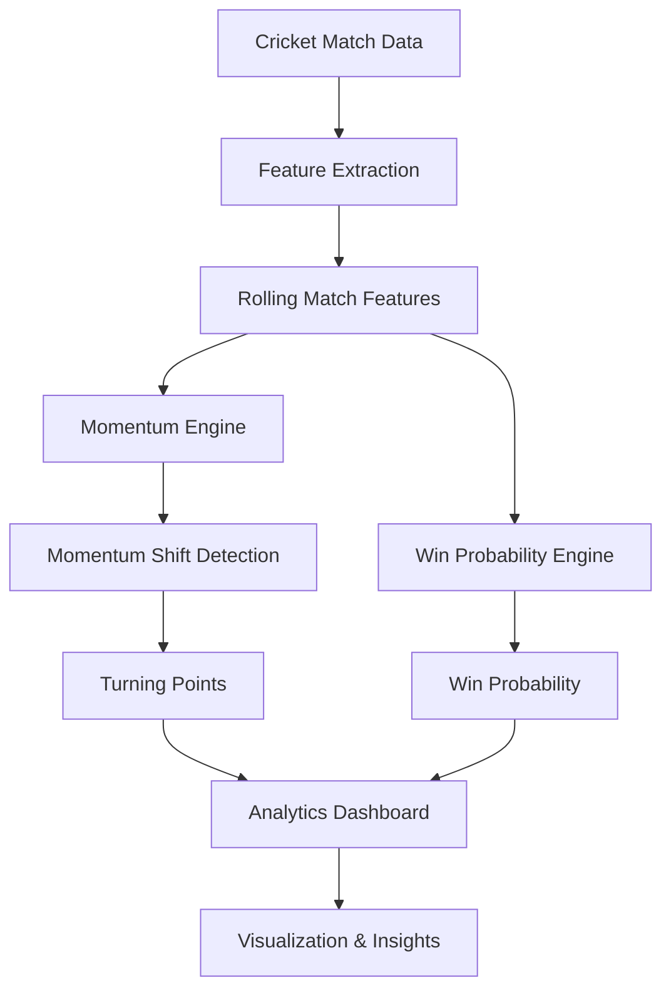

# 👋 Hey, I'm Sachin N B

### 💻 Computer Science Engineer | AI/ML Enthusiast | Full-Stack Developer | Cricket Analytics Builder

> **Turning ideas into intelligent, practical, and impactful software.**

<p align="center">
  <a href="https://github.com/Sachin-nb">
    
  </a>
  
  
</p>

---

## 🧑‍💻 About Me

I'm **Sachin N B**, a Computer Science and Engineering student at **K S School of Engineering and Management (KSSEM)** with a strong interest in building real-world software solutions.

I enjoy working at the intersection of **Artificial Intelligence, Machine Learning, Full-Stack Development, and Data Analytics**.

Rather than building projects just to demonstrate a technology, I like taking a real problem, breaking it down, designing a solution, and turning it into a working application.

🚀 My interests include:

* 🤖 Artificial Intelligence & Machine Learning
* 🌐 Full-Stack Web Development
* 📊 Data Analytics & Visualization
* 🏏 Cricket Analytics
* 🧠 Machine Learning Explainability
* ⚙️ Backend & API Development
* 💡 Building practical technology solutions

---

## ⚡ What I Do

```text
💡 Problem
   ↓
🔍 Understand
   ↓
🧠 Design the Solution
   ↓
💻 Build
   ↓
📊 Analyze & Improve
   ↓
🚀 Deploy
```

I believe the best way to learn technology is to **build with it**.

---

# 🛠️ Tech Stack

### 👨‍💻 Languages

<p>
  
  
  
  
  
</p>

### 🌐 Frontend

<p>
  
  
  
  
  
</p>

### ⚙️ Backend & APIs

<p>
  
  
  
</p>

### 🤖 AI / Machine Learning

<p>
  
  
  
  
</p>

### 🗄️ Database & Tools

<p>
  
  
  
  
</p>

---

# 🚀 Featured Project

## 🏏 CricShift — Cricket Momentum Shift Detector

> **Understanding not just what happened in a cricket match, but when the game started changing.**

**CricShift** is a cricket analytics platform designed to detect **momentum shifts** during matches and analyze how changing match situations can influence **winning probability**.

Traditional scoreboards tell us the score.

CricShift tries to answer a deeper question:

> **"When did the match start turning, and what caused the shift?"**

### 🔥 Core Features

* 📈 Dynamic Momentum Index
* 🎯 Win Probability Engine
* 🏏 Ball-by-Ball Match Analytics
* ⚡ Momentum Shift Detection
* 🔄 Turning Point Detection
* 📊 Live Momentum Visualization
* 📉 Win Probability Graph
* 🧮 Rolling Match Statistics
* 🔥 Pressure Index
* 🏃 Run Rate Acceleration
* 💥 Boundary Frequency Analysis
* 🟢 Dot Ball Percentage
* 📂 CSV Match Data Upload
* ▶️ Match Playback Controls
* 🧠 Machine Learning Analysis
* 🔍 SHAP Explainability

### 🏗️ Architecture



### 🧰 CricShift Tech Stack

| Layer             | Technologies               |
| ----------------- | -------------------------- |
| 🎨 Frontend       | Next.js, React, TypeScript |
| 💎 UI             | Tailwind CSS, shadcn/ui    |
| 🎞️ Animation     | Framer Motion              |
| 📊 Visualization  | Recharts                   |
| ⚙️ Backend        | Python, FastAPI            |
| 🤖 ML             | Scikit-learn               |
| 🔍 Explainability | SHAP                       |
| 🗄️ Database      | SQLite, Prisma             |
| 📡 Data           | Cricket datasets / APIs    |

🔗 **Repository:** [CricShift](https://github.com/Sachin-nb/CricShift)

---

# 💻 Other Project

## 💻 Qualitron Laptop Store

A full-stack laptop shopping and recommendation web application built with **Flask and SQLite**.

### ✨ Features

* 💻 Laptop Product Catalog
* 🔎 Product Filtering
* 💰 Laptop Price Prediction
* 🤖 Recommendation System
* ⚖️ Laptop Comparison
* 🛒 Shopping Cart
* 💳 Checkout System
* 🧾 Invoice Generation
* 🛡️ Warranty Information
* 🎒 Accessories
* 📚 Laptop Buying Guides

### 🧰 Technologies

`Python` `Flask` `SQLite` `HTML` `CSS` `JavaScript`

---

# 🧠 Currently Exploring

```text
Artificial Intelligence
        │
        ├── Machine Learning
        ├── Explainable AI
        ├── Predictive Analytics
        │
        ▼
Data-Driven Applications
        │
        ├── Cricket Analytics
        ├── Real-Time Insights
        └── Intelligent Systems
        │
        ▼
Full-Stack Engineering
        │
        ├── Next.js
        ├── React
        ├── FastAPI
        └── Modern Web Applications
```

---

# 🎯 My Development Goals

* 🚀 Build production-quality applications
* 🤖 Strengthen my AI/ML expertise
* 🌐 Become a stronger full-stack developer
* 📊 Build intelligent data-driven systems
* 🧠 Explore explainable and practical AI
* 🏗️ Create meaningful open-source projects
* 📚 Continuously learn new technologies

---

# 💭 My Developer Philosophy

> **Don't just learn technology. Build something that makes the technology meaningful.**

I believe in:

```text
Learn → Build → Break → Debug → Improve → Repeat
```

Every project is an opportunity to understand something deeper.

---

# 📊 GitHub Activity

<p align="center">
  
  
</p>

<p align="center">
  
</p>

---

# 🌱 Beyond Code

For me, software development isn't only about writing code.

It's about:

**Curiosity → Creativity → Problem Solving → Experimentation → Impact**

I'm continuously exploring new ideas, building projects, experimenting with technologies, and looking for better ways to turn real-world problems into software solutions.

---

# 🤝 Let's Connect

<p align="center">

<a href="https://github.com/Sachin-nb">

</a>

<!-- Add your links below -->

<a href="#">

</a>

<a href="#">

</a>

<a href="#">

</a>

</p>

---

<p align="center">

### ⚡ Building today. Learning every day. Creating what's next.

**Thanks for visiting my profile! 👋**

</p>
